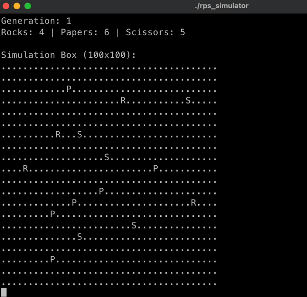

Rock Paper Scissors Simulator

A C++ simulation of the classic Stone-Paper-Scissors (Rock-Paper-Scissors) game, where objects representing rocks, papers, and scissors move randomly in a 2D box, collide according to standard rules, and eventually only one type wins.

Features
Simulation of Movement: Objects randomly move inside a box, bouncing off the boundaries.

Collision Detection: When two objects meet, the winner is determined by standard RPS rules.

Transformation: The losing object is converted to the winner’s type.

End Condition: Simulation ends when only one object type remains.

Console Visualization: ASCII display shows the state and locations of each object.

Easy Customization: Adjust number of objects or simulation parameters in the code.

How It Works
Initialization: 5 rocks, 5 papers, and 5 scissors are placed randomly in a box.

Random Movement: Each object is assigned a velocity and moves each simulation step.

Collisions: Upon collision, objects transform according to RPS rules:

Rock beats Scissors (Scissors turns to Rock)

Scissors beats Paper (Paper turns to Scissors)

Paper beats Rock (Rock turns to Paper)

Victory: Simulation ends when all objects are of a single type, which is declared the winner.

## Demo

